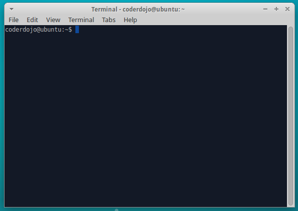
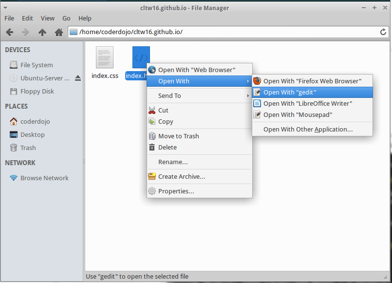
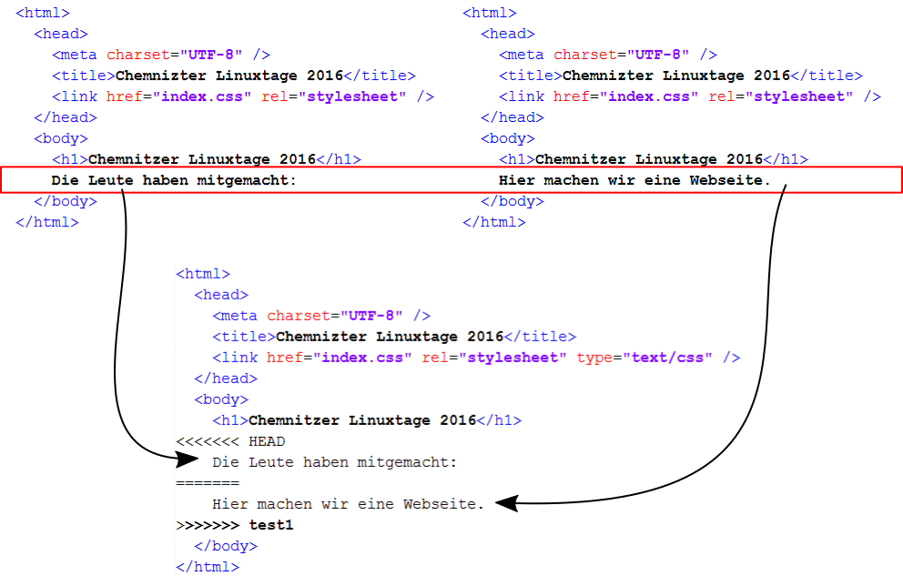
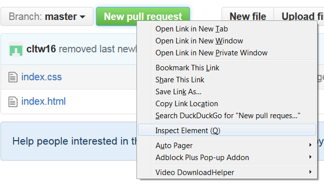
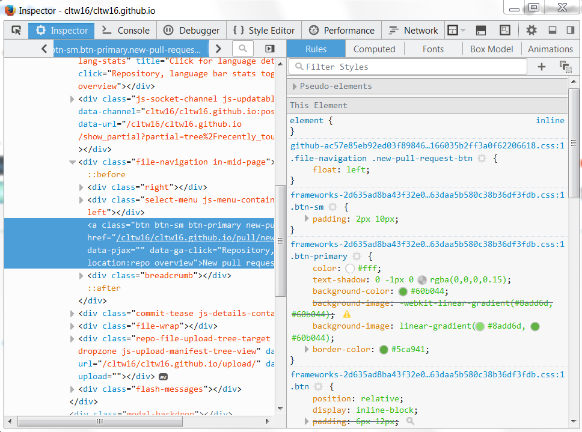

# 1 Einführung in die Kommandozeile

Git ist ein Versionierungssystem für Dateien. Es wird benutzt, um Software im Team zu erstellen. Im folgenden benutzen wir es zusammen, um eine Webseite zu gestalten. Die Webseite ist schon auf [github](http://niccokunzmann.github.io/chemitzer-linuxtage/), aber ohne Inhalt.

## 1.1 Die Kommandozeile

Öffne ein "Terminal" 

Alles was hinter einem `$` steht, ist ein Befehl, den du eintippen musst. Versuche es:

    $ ls 

Jetzt wir der Inhalt des Ordners, wo wie Kommandozeile ist, ausgegeben.

    Desktop    Downloads  Pictures
    Documents  Music      Public    Videos

Ich schreibe es als 

    $ ls 

    Desktop    Downloads  Pictures
    Documents  Music      Public    Videos

`ls` heißt "liste auf".

## 1.2 Eine lokale Kopie der Webseite holen

Der Befehl in folgenden Zeile erzeugt eine lokale Kopie der [Webseite](https://github.com/cltw16/cltw16.github.io):

    $ git clone https://github.com/cltw16/cltw16.github.io.git

    Cloning into 'cltw16.github.io'...
    remote: Counting objects: 7, done.
    remote: Compressing objects: 100% (5/5), done.
    remote: Total 7 (delta 1), reused 7 (delta 1), pack-reused 0
    Unpacking objects: 100% (7/7), done.
    Checking connectivity... done.
    
Fertig, nun hast du die Webseite hochgeladen und sie sollte bald unter [cltw16.github.io](https://cltw16.github.io) sichtbar sein.

## 1.3 In der Kommandozeile navigieren

Um herauszufinden, in welchem Ordner die Kommandozeile ist, benutze

    $ pwd 

    /home/coderdojo

Den Ordner, in diesem Fall `/home/coderdojo`, kannst du auch mit dem Dateibrowser öffnen. `pwd` heißt "print working directory" = "drucke Arbeitsverzeichnis"

Wenn du jetzt alle Inhalte anzeigst, mit `ls`, dann ist ein neuer Ordner dazugekommen:

    $ ls

    cltw16.github.io      Desktop    Downloads  Pictures
    Documents  Music      Public     Videos

Du kannst in den Ordner navigieren mit `cd` - "change directory" = "wechsele Verzeichnis".

    $ cd cltw16.github.io

Der Inhalt sieht z.B. so aus:

    $ ls 

    index.css  index.html

## 1.4 Die Webseite anzeigen

Um die Webseite anzuzeigen benutze den Firefox Webbrowser:

    $ firefox index.html

Oder, damit firefox nicht die Kommandozeile blockiert, starte es im Hintergrund:

    $ firefox index.html &

Du kannst die Webseite immer neuladen, indem du die "F5"-Taste benutzt.

# 2 Die Webseite

Jetzt sehen wir die Webseite lokal und auf github. In den folgenden Abschnitten wirst du sie verändern.

# 2.1 Die Webseite verändern

Webseiten werden in HTML = "Hyper Text Markup Language" geschrieben. Das ist einfacher Text, den man mit einem beliebigen Texteditor editieren kann. Ich benutze "gedit". "Mousepad" oder "Sublime Text" und viele mehr kann man dazu benutzen.

Bei HTML gitb es tags. Tags sind alles, was zwischen dem Kleinerzeichen `<` und  Größerzeichen `>` steht. Alles andere ist der Text, den man sieht. Hier ist die Webseite mit Tags:

    <html>
      <head>
        <meta charset="UTF-8" />
        <title>Chemnizter Linuxtage 2016</title>
        <link href="index.css" rel="stylesheet" />
      </head>
      <body>
        <h1>Chemnitzer Linuxtage 2016</h1>
      </body>
    </html>

Und hier ist die Webseite ohne Tags:

    Chemnizter Linuxtage 2016
    Chemnitzer Linuxtage 2016

Die Tags sind dazu da, die Webseite zu gestalten. 

Dafür gibt es Regeln:

1. Jedes Tag, das geöffnet wird `<html>` wird auch wieder geschlossen, indem man ein `/` vor den Namen tut. `</html>`
2. Tags, die keinen text dazwischen haben, werden sofort mit `/` beendet. `<link     />`
3. Für uns Menschen ist es schön, eine Einrückung zu machen, um besseren Überblick zu erhalten, wenn etwas geöffnet und geschlossen wird.

        

          Das ist ein Absatz
        

## 2.2 Webseitenstruktur

So sieht z.B. eine leere Webseite aus:

    <html>
      <head>
      </head>
      <body>
      </body>
    </html>

Alles, was sich zwischen den `html`-tags befindet, zählt zur Webseite.  
Alles, was sich zwischen den `head`-tags befindet, ist Information über die Webseite.
Alles, was sich zwischen den `body`-tags befindet, ist Inhalt der Webseite.

Z.B. ist `<title>Chemnizter Linuxtage 2016</title>` der Titel der Webseite. `<h1>Chemnitzer Linuxtage 2016</h1>` ist dann die große Überschrift in dem Inhaltsbereich. 

## 2.3 Tags für den Inhalt

Erstelle eine leere Webseite.
Hier sind ein paar Tags zum ausprobieren:

- `h1` **Überschriften**: `h2`, `h3`, `h4` sind auch Überschriften.   
    Beispiel:

        <h2>Leute, die mitmachen:</h2>

    <h2>Leute, die mitmachen:</h2>

- `a` **Links**: Links erhalten ein Attribut `href` - "Hyper Reference".  
     Beispiel:

        <a href="https://github.com/cltw16/cltw16.github.io">Github Repository</a>
    
    <a href="https://github.com/cltw16/cltw16.github.io">Github Repository</a>

- `img` **Bilder**: Man kann Bilder, "Images", einbinden. "src" = "source" = "Quelle"
    Beispiel:

        

     

- `p` **Absätze**

        

          Das ist ein Absatz
        

        

          Das ist noch ein Absatz
        

    

      Das ist ein Absatz
    

    

      Das ist noch ein Absatz
    

- `br` **Zeilenumbrüche**

        Dieser Text enthält 
        einen Zeilenumbruch.

    Dieser Text enthält 
    einen Zeilenumbruch.

- `div` **Abschnitte**: Ein Seite enhält z.B. die Abschnitte "Menu", "Inhalt", "Fußzeile". In das class-Attribut kommt der Name, der später zum Styling benutzt wird.

        
Inhalt der Seite

    
Inhalt der Seite

Weitere Tags findest du hier: [w3schools.com/tags](http://www.w3schools.com/tags/).

# 3 Git - Mit Veränderungen arbeiten

Die veränderungen, die du an der Webseite gemacht hast, sollen auf github erscheinen. Darum geht es jetzt.

## 3.1 Änderungen Speichern und verbreiten

Um die Änderungen zu speichern, muss Folgendes verstanden werden:

> Dein lokales Repository besteht aus drei "Instanzen", die von git verwaltet werden. Die erste ist deine **Arbeitskopie**, welche die echten Dateien enthält. Die zweite ist der **Index**, welcher als Zwischenstufe agiert und zu guter Letzt noch der **HEAD**, der auf deinen letzten Commit zeigt. 

-- [roger dudler](https://rogerdudler.github.io/git-guide/index.de.html)

### 3.2 Dateien zum Index hinzufügen

Um Dateien zum Index hinzuzufügen, benutzt man `git add`. Vorrausgesetzt, `index.html` hat Änderungen, sieht git die Arbeitskopie erstmal so:

    $ git status

    On branch master
    Your branch is ahead of 'origin/master' by 3 commits.
      (use "git push" to publish your local commits)
    Changes not staged for commit:
      (use "git add <file>..." to update what will be committed)
      (use "git checkout -- <file>..." to discard changes in working directory)

      modified:   index.html

    no changes added to commit (use "git add" and/or "git commit -a")

Dann fügen wir `index.html` zum Index hinzu:

    $ git add index.html
    $ git status

    On branch master
    Your branch is ahead of 'origin/master' by 3 commits.
      (use "git push" to publish your local commits)
    Changes to be committed:
      (use "git reset HEAD <file>..." to unstage)

      modified:   index.html

Damit haben wir gesagt, dass wir eine neue Version unseres Rpositories mit der neuen `index.html`-Datei erstellen wollen. Jetzt können wir z.B. noch mehr Dateien hinzufügen.

### 3.3 Eine neue Version der Webseite erstellen

Alle Dateien, die im Index stehen, können mit `git commit` zu einer neuen Version hinzugefügt werden. Dateien, die nicht im Index stehen, werden so belassen. Jede Version hat einen Nachricht, damit man weiß, wozu sie erstellt wurde. Z.B. habe ich meinen Namen eingetragen. Meine neue version heißt dann "Nicco Kunzmann zur Namensliste hinzugefügt". Der Befehl sieht so aus:

    $ git commit -m"Nicco Kunzmann zur Namensliste hinzugefügt"

    [test1 001d167] Nicco Kunzmann zur Namensliste hinzugefügt
     1 file changed, 1 insertion(+)

Die neue Version sollte auf [github](https://github.com/cltw16/cltw16.github.io) hochgeladen worden sein und müsste bald auch auf der [Webseite](http://cltw16.github.io) auftauchen.

### 3.4 Die Version hochladen

Mit `git push` werden neue Versionen hochgeladen. Das kann so aussehen, wenn es funktioniert:

    $ git push

    Username for 'https://github.com': cltw16  
    Password for 'https://cltw16@github.com': 
    Counting objects: 9, done.
    Delta compression using up to 3 threads.
    Compressing objects: 100% (9/9), done.
    Writing objects: 100% (9/9), 923 bytes | 0 bytes/s, done.
    Total 9 (delta 4), reused 0 (delta 0)
    To https://github.com/cltw16/cltw16.github.io.git
       e6d7fc2..e9e9a3b  master -> master

Da wir aber alle gleichzeitig daran arbeiten, ist es wahrscheinlich, dass jemand anderes schon eine neue Version hochgeladen hat. Diese müssen wir dann zuerst runterladen und unsere Veränderungen "mergen" = "einarbeiten". Hier siehst du, wenn der Push nicht klappt:

    $ git push

    Username for 'https://github.com': cltw16
    Password for 'https://cltw16@github.com': 
    To https://github.com/cltw16/cltw16.github.io.git
     ! [rejected]        master -> master (fetch first)
    error: failed to push some refs to 'https://github.com/cltw16/cltw16.github.io.git'
    hint: Updates were rejected because the remote contains work that you do
    hint: not have locally. This is usually caused by another repository pushing
    hint: to the same ref. You may want to first integrate the remote changes
    hint: (e.g., 'git pull ...') before pushing again.
    hint: See the 'Note about fast-forwards' in 'git push --help' for details.

Jetzt ziehen wir uns die neue Version, wieder gibt es zwei Möglichkeiten. Hier siehst du, dass das ziehen der neuen Version problemlos vonstatten geht:

    $ git pull

    remote: Counting objects: 1, done.
    remote: Total 1 (delta 0), reused 0 (delta 0), pack-reused 0
    Unpacking objects: 100% (1/1), done.
    From https://github.com/cltw16/cltw16.github.io
       e9e9a3b..dc2b6a4  master     -> origin/master
    Updating e9e9a3b..dc2b6a4
    Fast-forward

### 3.5 Versionskonflike beheben

Jetzt kann es aber auch zu Versionskonflikten kommen, wenn du und jemand anders die selbe Datei an der selben Stelle editiert hast. Git kann nicht wissen, ob dein Text vor dem anderen kommt oder danach.

    Auto-merging index.html
    CONFLICT (content): Merge conflict in index.html
    Automatic merge failed; fix conflicts and then commit the result.

Mit `git status` können wir uns nun die Probleme ansehen:

    $ git status

    On branch master
    Your branch is ahead of 'origin/master' by 1 commit.
      (use "git push" to publish your local commits)
    You have unmerged paths.
      (fix conflicts and run "git commit")

    Unmerged paths:
      (use "git add <file>..." to mark resolution)

      both modified:   index.html

    no changes added to commit (use "git add" and/or "git commit -a")

In diesem Fall wurde die Datei `index.html` sowohl von dir als auch in der Onlineversion verändert. Das Bild verdeutlicht, dass es ein Problem gibt, das git nicht ohne dein Wissen beheben kann:

Alle bis auf die rot umrandeten Zeilen sind gleich, also weiß git, dass das zusammenführen da gut geht. Die rot umrandeten Zeilen hingegen sind an der selben Stelle und unterschiedlich. Git markiert die Probleme in der Datei `index.html` jetzt. Diese muss editiert werden. Im HEAD waren deine Änderungen:

    <<<<<<< HEAD
        Die Leute haben mitgemacht:
    =======

Die anderen Änderungen befinden sich darunter (in meinem Fall die aus "test1", in dem pull-Fall bestimmt von "origin/master"):

    =======
        Hier machen wir eine Webseite.
    >>>>>>> test1

Du kannst die Änderungen jetzt selbst zusammenführen:

    <html>
      <head>
        <meta charset="UTF-8" />
        <title>Chemnizter Linuxtage 2016</title>
        <link href="index.css" rel="stylesheet" type="text/css" />
      </head>
      <body>
        <h1>Chemnitzer Linuxtage 2016</h1>
        Hier machen wir eine Webseite.
        Die Leute haben mitgemacht:
      </body>
    </html>
Speichern und wieder eine neue Version erstellen, ich verwende hier die Nachricht "merged":

    $ git add index.html
    $ git commit -m"merged"

    [master e9e9a3b] merged

Und mit `git push` geht es wieder zurück zu Schritt 3.4.

Jetzt hast du alle Basics für die Kollaboration mit git gelernt. Wenn du Fehler hier im Tutorial findest, kannst du sie beheben und mit git hochladen.

# 4 Weiterführende Links

Nachdem du jetzt die wichtigsten Fälle der Kollaboration mit Git durchgegangen bist, gibt es viele Möglichkeiten, weiterzumachen.

## 4.1 Die Webseite stylen

Was auf die Webseite kommt, liegt an euch. Es gibt ein [Tutorial von der OpentechSchool](http://opentechschool.github.io/html-css-beginners/de/index.html), das in Webseiten einführt. Mache die ersten Kapitel und du verstehst CSS.

Wenn es dann langweilig wird, schau auch andere Seiten mit gutem Style an und kopieren ihn. Dazu Rechtsklick auf das Element, das dir gefällt:

Und dort findest du den Style, den du zur css-Datei hinzufügen kannst:

## 4.2 Branches

Git erlaubt es dir, an mehreren Aufgaben gleichzeitig zu arbeiten. Dazu verwendet man "branches" = "Zweige", die man auch so mergen kann, wie andere Repositories. Dazu könnt ihr [hier](https://rogerdudler.github.io/git-guide/index.de.html) mehr lesen.

## 4.3 Webseiten auf github

Auf github kan man seine Webseiten publizieren. z.B. kann man sie auf in ein Repository packen, das dann automatisch angezeigt wird. Jedes Repository kann eine solche Webseite haben, in einem Branch namens "gh-pages" (NUTZERNAME.github.io/REPOSITORY). Jeder Benutzer kann eine Webseite haben, im Branch "master" im Repository NUTZERNAME.github.io (die Variante, die wir verwenden). Mehr darüber zu lesen gibt es [hier](https://pages.github.com/).

## 4.4 Javascript

Du kannst Webseiten zu vollen Programmen machen, indem du JavaScript benutzt. Dazu gibt es viele Tutorials.

- [opentechschool.github.io/js-beginners-1](http://opentechschool.github.io/js-beginners-1/)
- [khanacademy.org/computing/computer-programming/programming](https://www.khanacademy.org/computing/computer-programming/programming)